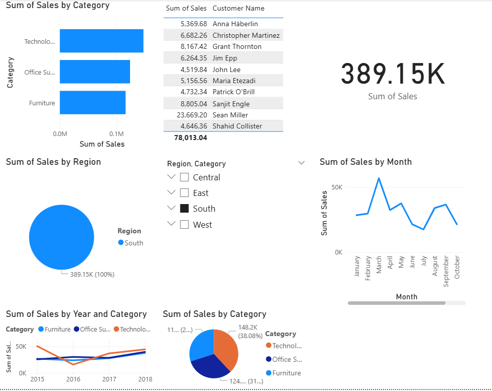

# 📊 Sales Data Analysis Dashboard | Power BI

## 🔍 Overview
This Power BI dashboard provides insights into company sales data by region, category, and customer.
It helps identify top-performing categories, yearly sales trends, and top customers.

## 🛠️ Tools Used
- Power BI
- Power Query
- Microsoft Excel / CSV dataset

## 📈 Key Features
- Sales by Category and Region
- Top 10 Customers by Sales
- Yearly Sales Trend
- Interactive filters (Region, Category)

## 🖼️ Dashboard Preview

## 📂 Files in this Repository
- `Sales_Dashboard.pbix` – Power BI dashboard file
- `train.csv` – Dataset used
- `README.md` – Project documentation
